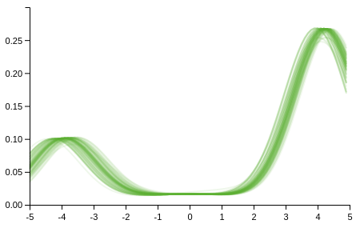
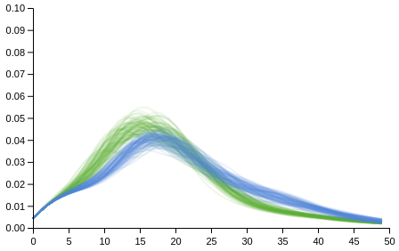

# Dirichlet Processes

The Dirichlet process can be created using `dirichlet-process`. It takes two arguments,
a concentration parameter and a base measure.
```
λ> (dirichlet-process 1 (normal 0 4))
#distributions.core.DirichletProcess{:concentration 1, :base-measure #distributions.core.Normal{:mean 0, :variance 4}}
```

In the following we assume that the data is generated from G which is modelled as a Dirichlet process.
After observing some data, one can get the posterior over G in the usual fashion

```
λ> (posterior [1.1 2.2 2.2] :G (dirichlet-process 1 (normal 0 4)))
#distributions.core.DirichletProcess{:concentration 4, :base-measure #distributions.core.Mixture{:components [#distributions.core.DiscreteReal{:locations (1.1 2.2), :probabilities (1/3 2/3)} #distributions.core.Normal{:mean 0, :variance 4}], :probabilities (1/2 1/2)}}
```

Prediction of a new observation can be obtained using the `posterior-predictive` function

```
λ> (posterior-predictive [1.1 2.2 2.2] :G (dirichlet-process 1 (normal 0 4)))
#distributions.core.Mixture{:components [#distributions.core.DiscreteReal{:locations (1.1 2.2), :probabilities (1/3 2/3)} #distributions.core.Normal{:mean 0, :variance 4}], :probabilities (1/2 1/2)}
```

When DP's are used as priors in larger models there is the `rn-alg3` function when conjugate base measures are used. There are plans to implement `rn-alg8` for non-conjugate priors soon. 

`(rn-alg3 observations likelihood base-measure concentration niter)`

Arguments are data, a model for the data depending on some parameters, a DP base measure for those parameters, a DP concentration parameter and number of iterations.
 `rn-alg3` returns a map with 3 keys
`:densities`, `:labels` and `:parameters`, each are vectors of length equal to number of iterations. The former is a vector of functions corresponding to the predictive densities
Here are some examples...

## Normal Mixtures
The data is generated from a two component normal mixture, with means -4 and 4, variances 1, and component probabilities 0.25 0.75. We shall use a DP to perform density estimation with
likelihood `(normal :mu 1)`, base measure `(normal 0 4)` and 
concentration 0.1.

```
(def proposal (mixture [(normal -4 1) (normal 4 1)] [(/ 1 4) (/ 3 4)]))
(def observations (sample proposal 100))
(def likelihood (normal :mu 1))
(def base-measure (normal 0 4))
(def concentration 0.1)
(def draws (rn-alg3 observations likelihood base-measure concentration 100))
(apply compose (map (fn [m] (plot m [-5 5] :colour "#62B132" :opacity 0.1 :plot-range [[-5 5] [0 0.3]])) (drop 10 (:densities draws))))
```



## Poisson Mixtures
The example here is the “Traffic” dataset from the “MASS”
R library for which the description reads

"An experiment was performed in Sweden in 1961-2 to assess the effect of a speed limit on the motorway accident rate. The experiment was conducted on 92 days in each year, matched so that day j in 1962 was comparable to day j in 1961. On some days the speed limit was in effect and enforced, while on other days there was no speed limit and cars tended to be driven faster. The speed limit days tended to be in contiguous blocks."

The data for when the speed limit was enforced is

```
λ> yes
(12 41 15 18 11 19 19 9 21 22 23 14 19 15 13 22 42 29 21 12 16 17 23 16 20 13 13 9 10 27 12 7 11 15 19 32 22 24 9 29 17 17 15 25 9 16 25 25 16 22 21 17 26 41 25 12 17 24 26 16 15 12 22 24 16 25 14 15 9)
```

and when not

```
λ> no
(9 11 9 20 31 26 18 19 18 13 29 40 28 17 15 21 24 15 32 22 24 11 27 17 27 37 32 25 20 40 21 18 35 21 25 34 42 27 34 47 36 15 26 27 18 16 32 28 17 16 19 18 22 37 29 18 14 14 18 21 39 39 21 15 17 20 24 30 25 8 21 9 20 15 14 30 23 15 14 16 20 10 14 18 26 38 31 12 8 22 17 31 49 23 14 25 24 18 19 21 19 24 44 31 21 20 19 20 29 48 36 15 16 29 12)
```
Each dataset can be modelled as a DP mixture of Poissons.
Here I use a Gamma 2 0.1 base measure, with concentration parameter 1.
```
(def likelihood (poisson :rate))
(def base-measure (gamma 2 0.1))
(def concentration 1)
(def yes-draws (rn-alg3 yes likelihood base-measure concentration 100))
(def no-draws (rn-alg3 no likelihood base-measure concentration 100))
```

```
(compose
 (apply compose (map (fn [m] (list-plot (map m (range 0 50)) :colour "#62B132" :opacity 0.1 :joined true :plot-range [[0 50] [0 0.1]])) (drop 10 (:densities yes-draws))))
 (apply compose (map (fn [m] (list-plot (map m (range 0 50)) :colour "#5882D6" :opacity 0.1 :joined true :plot-range [[0 50] [0 0.1]])) (drop 10 (:densities no-draws)))))
```

