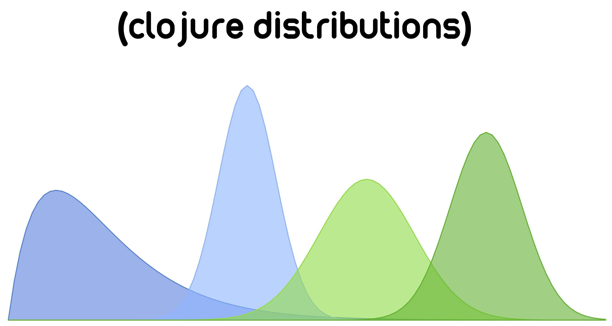

# Introduction to Distributions
Distributions is a statistical computing environment for Clojure. It uses
Clojures protocols and multimethods to build a rich abstraction for interacting with
and manipulating probability distributions, as well as extra functionality to make the lives
of those working with probabilistic models little bit easier. Hopefully
you will be pleased by some of the design choices that were made in building the distributions API.

Michael Lindon

# Features
* Idiomatic Clojure wrappers around Apache commons math distributions
* Additional distributions not present in ACM
* Truncated Distributions
* Mixture Distributions
* Location-Scale Distributions
* Marginal Distributions
* Posterior Distributions
* Posterior Predictive Distributions
* Sampling Algorithms
* Gaussian Processes
* Dirichlet Processes
* Chinese Restaurant Process
* Inhomogeneous Poisson Point Processes
* Special Mathematical Functions

# Installation with Leiningen
Add the following dependency in your project.clj file

