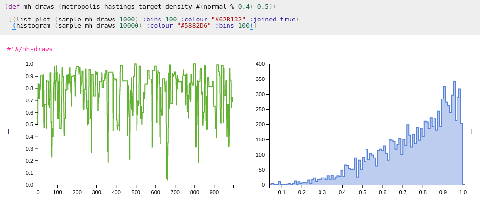
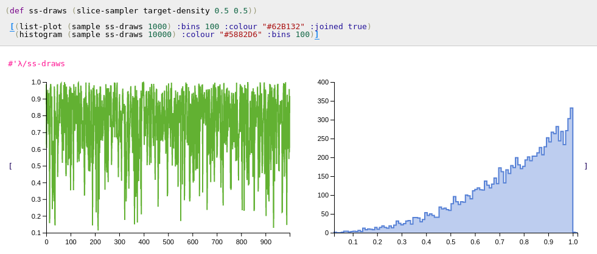
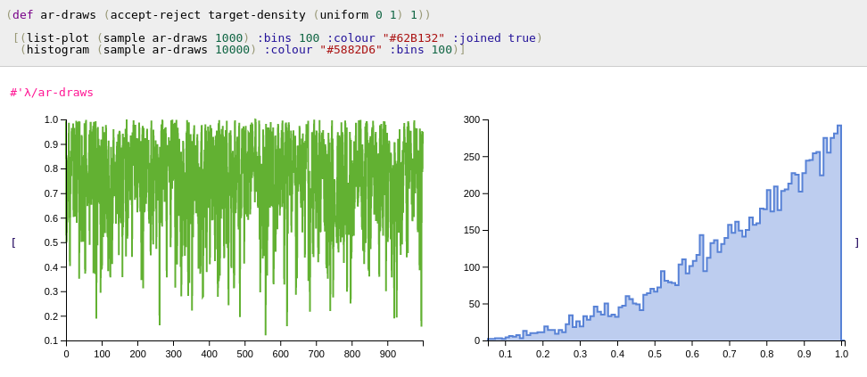

# Sampling Algorithms
For univariate distributions which extend protocols implementing cdf and icdf, generating independent draws can be achieved using the inverse-cdf method. For those extending only the protocol implementing cdf, icdf can fall back onto its default root finding algorithm, and the inverse-cdf method can still be used.

For other more exotic distributions of interest other sampling algorithms may be needed.

To illustrate these algorithms lets assume a trivial distribution that has a density propotional to x^2 on the unit interval

```
λ> (defn target-density [x]
     (cond
       (> x 1) 0
       (< x 0) 0
       :else (/ (* x x) 3)))
```


## Metropolis-Hastings
`(metropolis-hastings target proposal seed)`

`(metropolis-hastings target proposal seed log-target)`

The `metropolis-hastings` function has multiple arities. The function taing 3 arguments assumes that the target (a function) passed in the first argument is not computed on the log-scale. The function accepting 4 arguments accepts an additional boolean value, allowing the user to specify whether the target function passed in the first argument is specified on the log scale. The second argument, proposal, should be a function that maps a value in the domain to distribution, as to form the proposal distribution. Seed is a value in the domain at which the algorithm is started.

Like other samples on this page, `metropolis-hastings` returns a lazy list of draws.
```
λ> (def mh-draws (metropolis-hastings target-density #(normal % 0.3) 0.5))
#'λ/mh-draws

λ> (sample mh-draws 5)
(0.5 0.5278844732151602 0.48958614718093274 0.48958614718093274 0.5880599159218269)
```
Here `#(normal % 0.3)` is an anonymous function that maps a parameter x to a normal distribution centered around x.
The `sample` function dispatches on the lazy list in order to maintain continuity of the API. As a lazy list, however, using `take` also works just fine.
```
λ> (take 5 mh-draws)
(0.5 0.5278844732151602 0.48958614718093274 0.48958614718093274 0.5880599159218269)
```
The advantage of using `take`, as the draws are no longer independent,
is that one can thin the draws to reduce dependence.
```
λ> (take 5 (take-nth 10 mh-draws))
(0.5 0.4425665105907383 0.5393113732753869 0.3961248334462656 0.890723381756662)
```




## Slice Sampling
`(slice-sampler target width seed)`

`(slice-sampler target width seed log-target?)`

Usage same as `metropolis-hastings` except width is a tuning parameter
corresponding to the width in the stepping out procedure.



## Accept Reject
`(accept-reject target proposal c)`

c is a constant such that target < c*proposal.

```
λ> (take 5 (accept-reject target-density (uniform 0 1) 1))
(0.8297629001889286 0.778066797774964 0.28981042074043706 0.8582759266577196 0.8942679865725314)
λ> (sample (accept-reject target-density (uniform 0 1) 1) 5)
(0.8841717452838114 0.9360229665247679 0.923946004811828 0.9770042699079926 0.5548516755781405)
```


